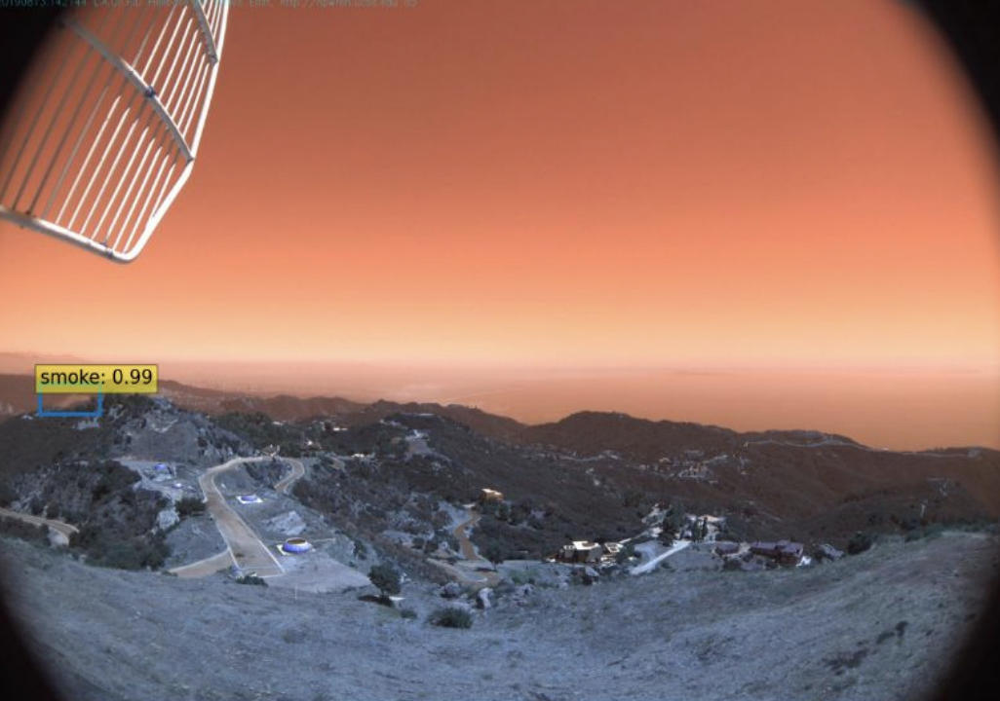
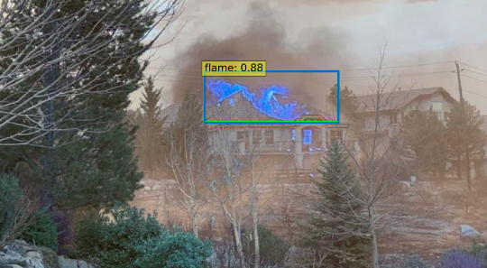
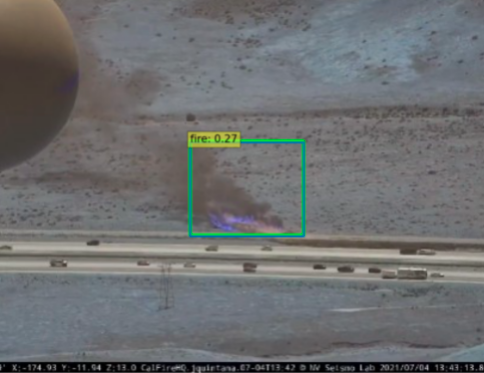

**NEmo: A wildfire smoke detection benchmark**
========
PyTorch training code and pretrained models for **NEmo** (**NE**vada s**mo**ke detection benchmark).

The Nemo wildfire smoke detection benchmark is a pretrained model based on Facebook AI's DETR that aims to detect wildfire in the early stages; incipient and growth stage. This model is created for object detection. It has a CNN backbone along with encoder-decoder transformers. It also uses bipartite matching loss function. It is trained using 2848 unique smoke images. The validation dataset included 174 smoke images as well. 

The Nemo model ran with 5 queries, 6 layers, and 200 epochs. The results are as follows:

Preliminary results evaluated on 75 images containing fire at incipient stage (first 15 minutes- this is a very challenging test set)
<table>
  <thead>
    <tr style="text-align: right;">
      <th></th>
      <th>IoU</th>
      <th>Area</th>
      <th>AP</th>
    </tr>
   </thead>
  <tbody>
    <tr>
      <th>0</th>
      <td>0.50:0.95</td>
      <td>all</td>
     <td>0.096</td>
    </tr>
    <tr>
      <th>1</th>
      <td>0.50</td>
      <td>all</td>
      <td>0.298</td>
    </tr>
    <tr>
      <th>2</th>
      <td>0.75</td>
      <td>all</td>
      <td>0.038</td>
    </tr>
    <tr>
      <th>3</th>
      <td>0.50</td>
      <td>small</td>
      <td>-1.00</td>
    </tr>
   <tr>
      <th>4</th>
      <td>0.50</td>
      <td>medium</td>
      <td>0.047</td>
    </tr>
   <tr>
      <th>5</th>
      <td>0.50</td>
      <td>large</td>
      <td>0.149</td>
    </tr>
  </tbody>
</table>

In this read.me file, you can find the instructions for the following tasks:
- Data Preparation 
- Testing our model 
- Fine Tuning our model 

In order to start reproducing our work, you need to install the following libraries: 

Conda Installs:
```

conda install pytorch torchvision   **Different depending on your computer**
**pytorch and torchvision must be compatible with each other, if you cannot get them to be compatible in your current environment, create a new one.**
pip install pycocotools

```

## Data preparation:

Download and extract NEMO 2020 train and val images with annotations from [ADD A URL ONCE DATASET IS PUBLIC]. We expect the directory structure to be the following: 
```
path/to/nemo/
  nemo_sample_train.json  # train annotation json file
  nemo_sample_val.json    # val annotation json file
  sample_train_frames/    # train images
  sample_val_frames/      # val images
```
**NOTE**: While train frames and annotations are not needed for testing and evaluation, placeholder directory and file with the same names are required (They can contain nothing, if all you want to do is to evaluate a set of validation images against a pre-trained model or simply do inference on a group of images based on a pretrained model).

The DETR model only accepts files in COCO JSON format. In order to create a dataset, annotate your images using any tool that specializes in object labelling, or that creates bounding boxes, that will export your annotations into JSON files. If you wish to use tools that don't export directly into COCO JSON format, you can convert your YOLO or CSV files into JSON files. It is easier to combine annotations and datasets using a non-JSON format if you are working with multiple people on one training dataset. You can convert CSV annotations to COCO JSON format using the following tutorial: https://medium.com/analytics-vidhya/how-to-convert-tensorflow-object-detection-csv-data-to-coco-json-format-d0693d5b2f75.  We converted our YOLO annotations into JSON files using https://github.com/Taeyoung96/Yolo-to-COCO-format-converter. If you follow the linked Github or export your annotations as a JSON file, your dataset will be ready to train the model.

## Testing the model:

In order to test the model, you need the following three things. The test.py script, our model, and a custom dataset. 

Install:
```
pip install opencv-python
```
You might also need to install ``pycocotools`` and ``scipy`` in your environment.

 1. Test.py script: This script takes a directory of images to be inferred against a model and displays image for each bounding box. To move between images with labelled bounding boxes, you can close the image. Once you see an image with green bounding boxes, press space to infer the next image. If an image in your dataset does not show, it means the model did not infer any bounding boxes for that image. To evaluate the performance of the model refer to Evaluating the model. It is important to note that all the changeable parameters such as number of layers and queries must match that of the model. If you plan on testing our model, you don't have to change anything, however, if you are testing using a model you designed with different parameters, you will need to pass those parameters accordingly. For example, if you trained the model with 5 queries, you need to pass ``--num-queries 5`` as an optional argument when executing ``test.py``. 
 2. Model: You need a pretrained model for inference. Our pre-trained models can be found in [Add a URL later]. The model is stored under the file ‘checkpoint.pth’. 
 3. Custom dataset: In order to test the model, you will need to have a dataset consisting of images with both smoke and non-smoke data. If you don’t have a dataset of your own, we have also provided the link to Govil et al.’s fuego dataset. (https://drive.google.com/file/d/1x4bzhH-ZgEUUvh45EStFNrTT_wLSPC35/view)

After you have all the necessary files listed above, you are ready to test the model using a custom dataset. In order to test the model, you can simply run the following script: 

If you have GPU:
```
python test.py --data_path [path_to_dataset] --resume [path_to_checkpoint.pth]
```

If you have CPU:
```
python test.py --data_path [path_to_dataset] --resume [path_to_checkpoint.pth] --device cpu
```

Here is a sample of the output: 



If you do not achieve such a result, make sure to go back and double check the checklist. 

## Evaluating the model:

In order to evaluate the model, simply run:
```
python main.py  --dataset_file smoke --data_path [path/to/dataset] --output_dir [path/to/output] --eval --resume [path/to/checkpoint.pth] --device [device] 
```
Example evaluation output on 20 images containing only fire and flame:
```
IoU metric: bbox
 Average Precision  (AP) @[ IoU=0.50:0.95 | area=   all | maxDets=100 ] = 0.117
 Average Precision  (AP) @[ IoU=0.50      | area=   all | maxDets=100 ] = 0.324
 Average Precision  (AP) @[ IoU=0.75      | area=   all | maxDets=100 ] = 0.084
 Average Precision  (AP) @[ IoU=0.50:0.95 | area=medium | maxDets=100 ] = 0.146
 Average Precision  (AP) @[ IoU=0.50:0.95 | area= large | maxDets=100 ] = 0.130
 Average Recall     (AR) @[ IoU=0.50:0.95 | area=   all | maxDets=  1 ] = 0.195
 Average Recall     (AR) @[ IoU=0.50:0.95 | area=   all | maxDets= 10 ] = 0.200
 Average Recall     (AR) @[ IoU=0.50:0.95 | area=   all | maxDets=100 ] = 0.200
 Average Recall     (AR) @[ IoU=0.50:0.95 | area=medium | maxDets=100 ] = 0.179
 Average Recall     (AR) @[ IoU=0.50:0.95 | area= large | maxDets=100 ] = 0.262
 ```
 Example inferences:
 
 Caughlin Ranch, Pinehaven Fire Nov 2020            |  Tumbleweed fire CA July 2021
:-------------------------:|:-------------------------:
  | 
 
 ## How to finetune our model:
 
 In order to finetune our model, or completely train a new one, you can follow the following steps:

1. Clone our github repository on your local desktop. 
   - In order to clone the repository, go into your desired directory and paste the following link via terminal: https://github.com/SayBender/Nemo.git 
   - This should automatically download all the necessary files along with samples of the dataset and JSON files into your local directory
2. Make sure your dataset is in COCO JSON format. In order to do this, you can check out the data preparation section above. 
3. Next, check out the following files as you will need to make edits: smoke.py and main.py 
   - All the necessary changes are already commented in the files themselves if you are training for smoke with 4 different classes of smoke.
   - If you want to change the number of classes, go to detr.py in the models folder, then scroll down to class build(args). Change num_classes for the dataset you want to change.
     - Our 4 different classes are smoke, fire, flame, and NightSmoke. If you want to change the labels go to test.py and change them in CLASSES.
   - Look for comments as we have already added all instructions on making the changes
   - To fine tune our model or to train a new smoke model, all you have to do is change the names of the JSON files and image folders for training and validation to access your files in the smoke.py file 
     - If you are satisfied with the default layers and number of queries then you can start training your model now and skip to 4.
   - If you wish to change the number of layers or number of queries go to main.py and scroll to # * Transformer in def get_args_parser(). There you will find and can change the number of queries and encoding and decoding layers.
     - Reflect those changes in test.py if you plan on testing your model.
4. After you are done making changes and your dataset is ready, you are ready to start training the model 
   - Start small by keeping the number of epochs to 1.
     - The epochs can be whatever you computer can handle, the default is 300 if you do not specify.
   - Run the model using the following code: 
```
GPU:
python main.py --dataset_file smoke --data_path ../dataset/ --output_dir output --epoch 1 
or
python main.py --dataset_file smoke --data_path ../dataset/[your_dataset]/ --output_dir [output_file] --epoch [number]
```
```
CPU:
python main.py --dataset_file smoke --data_path ../dataset/ --output_dir output --epoch 1 --device cpu
or
python main.py --dataset_file smoke --data_path ../dataset/[your_dataset]/ --output_dir [output_file] --epoch [number] --device cpu
```

   - To fine tune a pretrained model, include the below onto the above code: 
   ```
   --resume [path_to_model/model]
   ```
   Example: 
   ```
   python main.py --dataset_file smoke --data_path ../dataset/ --output_dir output --epoch 1 --device cpu --resume ../output/checkpoint.pth
   ```
   - You can change the number of layers and queries using --enc_layers [ENC_LAYERS] --dec_layers [DEC_LAYERS] --num_queries [NUM_QUERIES] for that run only.
     - Include these arguments when running test.py if you trained your model using them.
5. After you have completed training your model, you can find the output files under the ‘output’ folder. 
   - The file names ‘checkpoint.pth’ will store your model 
6. To test your model, you can following the directions under ‘Testing your model’


